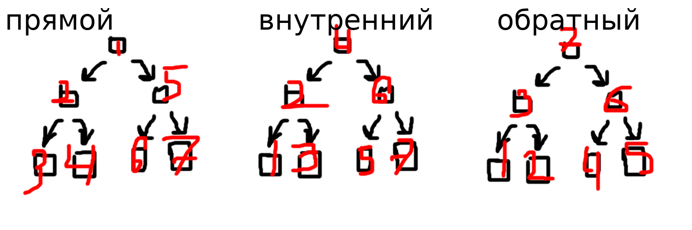

# Обход деревьев

**Обход деревьев** - последовательное посещение вершин с некоторой обработкой их данных.

Существует **три** основных обхода дерева:



 1. **Прямой** состоит в посещении корня p-обхода левого поддерева и p-обходов правого поддерева.
 2. **Внутренний** состоит в v-обходе левого поддерева, посещение корня, посещения v-обхода правого поддерева.
 3. **Обратный** состоит в посещении o-обхода левого поддерева, посещении o-обхода правого дерева, посещении корня.

**Л** - левый
**П** - правый
**К** - корень

```
      v---------(8)---------v
 v---(3)---v               (10)---v
(1)     v-(6)-v              v---(14)
       (4)   (7)           (13)
```

|КЛП|`8 3 1 6 4 7 10 14 13`|
|ЛКП|`1 3 4 6 7 8 10 13 14`|
|ЛПК|`1 4 7 6 3 13 14 10 8`|

Всего обходов 6.


Функция прямого обхода:

```cpp
void print(tree * p)
{
	if (p != NULL)
	{
		std::cout << "\nElem: " << p->info;
		std::cout << "\n---------\n";
		print(p->L);
		print(p->R);
	}
}
```

__*Пример 1*__. Найти сумму листьев дерева.

```cpp
int Sum(tree * p)
{
	if (p != NULL)
	{
		if (p->L == NULL && p->R == NULL)
		{
			return p->info + Sum(p->L) + sum(p->R);
		}
		return Sum(p->L) + Sum(p->R);
	}
	return 0;
}

void main()
{
	int x;
	tree * beg = new tree;
	cin >> x;
	beg->info = x;
	beg->L = NULL;
	beg->R = NULL;
	while (x != 0)
	{
		cin >> x;
		if (x != 0)
			add(beg<x);
	}
	cout << "Sum=" << Sum(beg);
	print(beg);
}
```

__*Пример 2*__. Заменить чётные элементы дерева нулём

```cpp
void Zam(tree * p)
{
	if (p != NULL)
	{
		if (p->info % 2 == 0) p->info = 0;
		Zam(p->L);
		Zam(p->R);
	}
}
```

```cpp
#include ...

struct tree
{
	int info;
	tree * L;
	tree * R;
};

void add(tree * t, int x)
{
	tree * q;
	if (x < t->info)
	{
		if (t->L == NULL)
		{
			q = new tree;
			q->info = x;
			q->L = NULL;
			q->R = NULL;
			t->L = q;
		} else add(t->L, x);
	} else {
		if (t->R == NULL)
		{
			q = new tree;
			q->info = x;
			q->L = NULL;
			....
		}
	}
}

мне короче впадлу писать она перелистнула
```
